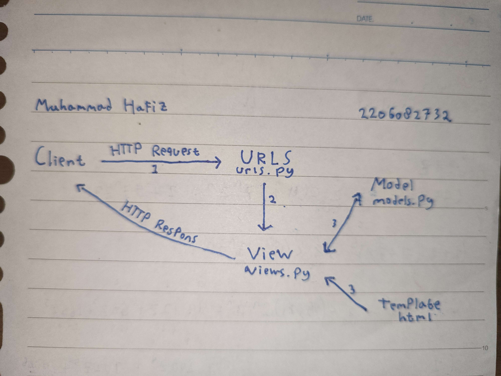
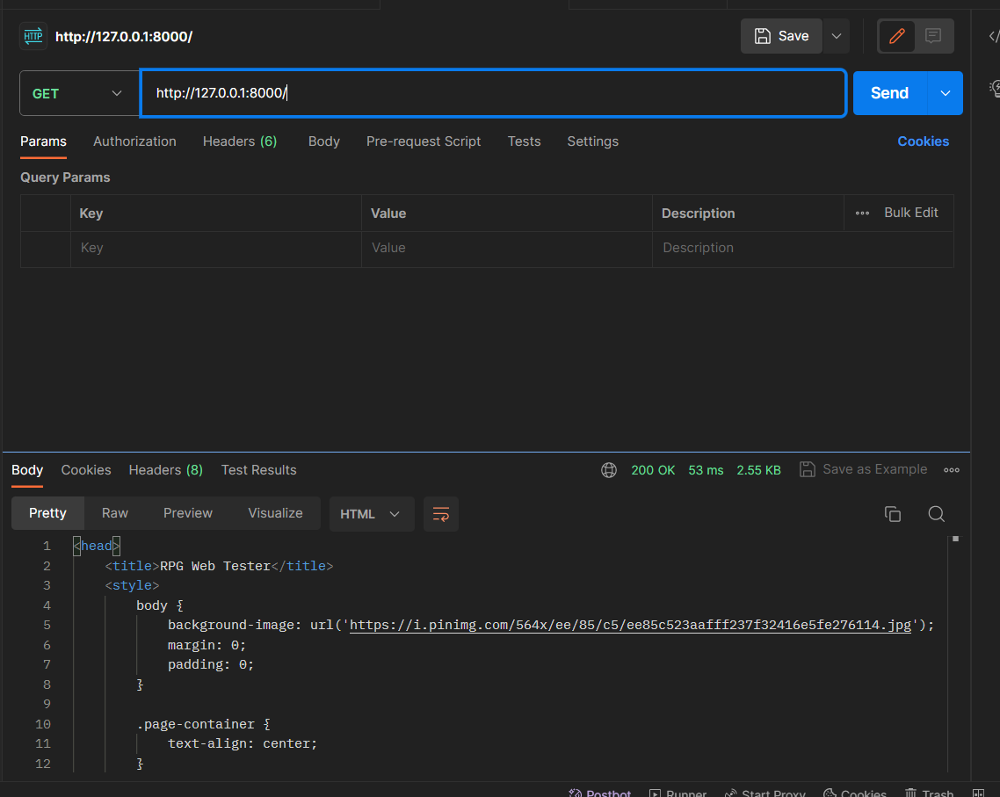
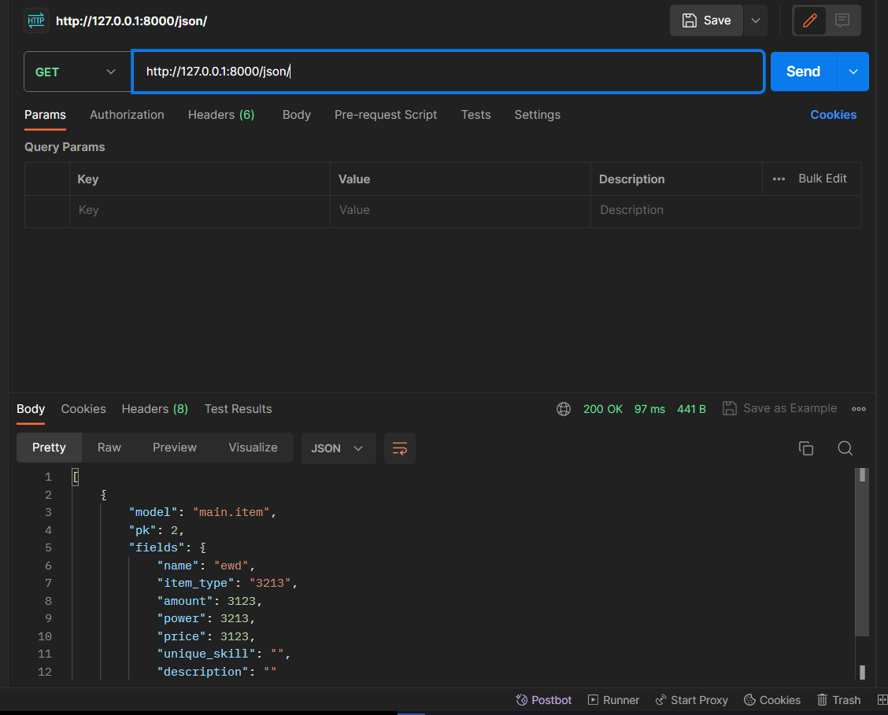
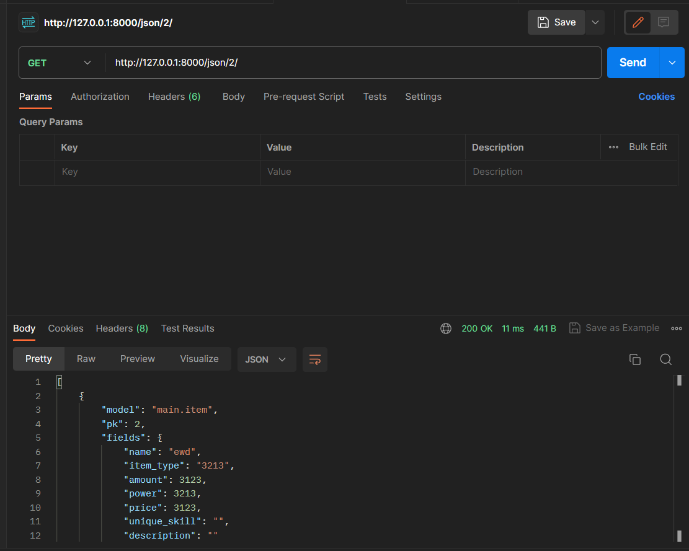
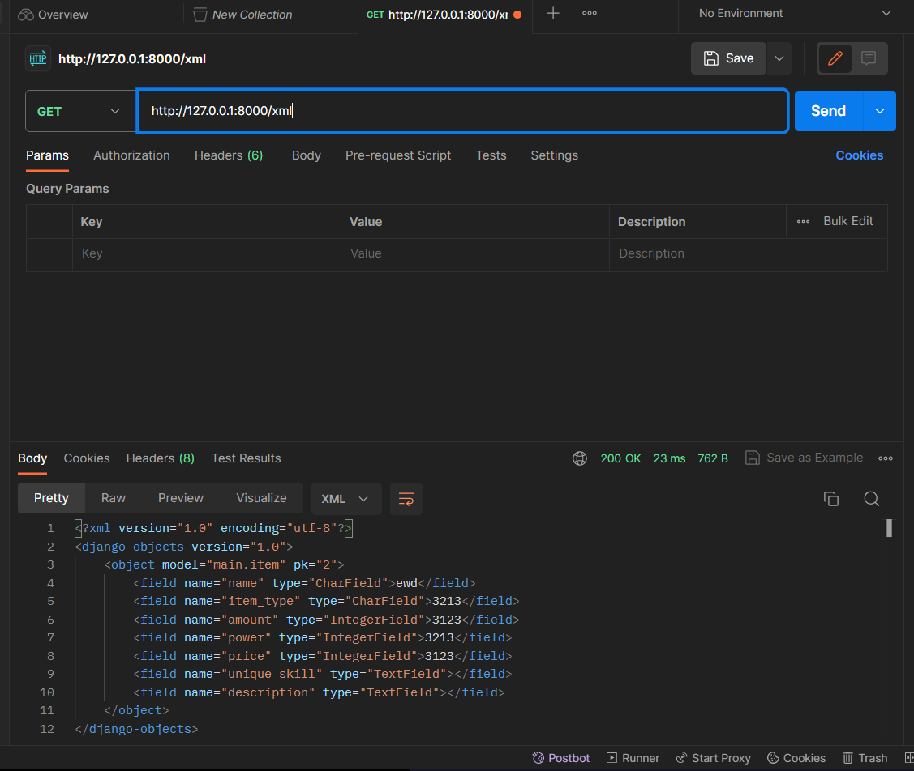
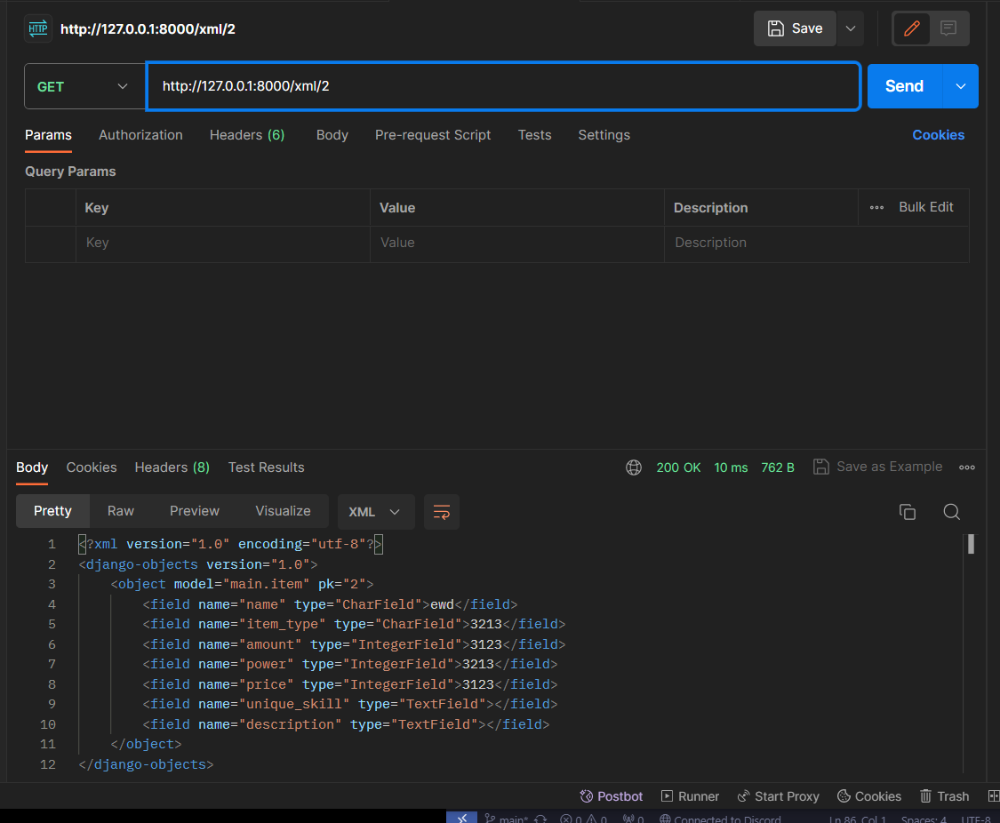

Nama : Muhammad Hafiz\
NPM : 22060827327\
Kelas : PBPF

============================================== TUGAS 2 ==============================================
------------------- Adaptable Project Link -------------------\
Link = https://rpg-web-tester.adaptable.app

------------------- Implement Checklist Tugas -------------------\
✅ Membuat project Django baru : Membuat folder baru dan menginisiasi git init di folder tersebut. Lalu membuat repository baru di github lalu menghubungkan repository github tersebut dengan lokal folder. Lalu mengaktifkan Virtual Environment, lalu masuk ke virtual environment tersebut. Lalu membuat file txt yang berisi library, frameworks dam package, lalu menginstall semua itu dengan menjalankan "pip install -r [nama file txt].txt". Lalu menjalankan "django-admin startproject [Nama Project]".\

✅ Membuat aplikasi dengan nama main pada proyek tersebut : Setelah masuk ke dalam folder project di terminal lalu masuk ke dalam virtual environment, lalu jalankan perintah "python manage.py startapp [Nama App]".\

✅ Melakukan routing pada proyek agar dapat menjalankan aplikasi main : Pada folder project buka file setting.py, lalu masukan nama app dalam bentuk string ke dalam list INSTALLED
_APPS.\

✅ Membuat model pada aplikasi main dengan nama Item dan memiliki atribut wajib sebagai berikut : Pada folder app main, buka file models.py dan membuat class baru bernama Item. Lalu di dalam class tersebut buat attribut nama yang berupa CharField, amount yang berupa IntegerField, dan description dalam bentuk TextField, serta sebagai tambahan aku membuat attribute power, item_id, item_type, price dan unique skill dengan berupa field yang cocok dengan masing-masing attribute.\

✅ Membuat sebuah fungsi pada views.py untuk dikembalikan ke dalam sebuah template HTML yang menampilkan nama aplikasi serta nama dan kelas kamu : Didalam file views.py membuat fungsi display_main, dimana didalmnya dibuat directory yang dimana key nya adalah variabel untuk memanggil value, dan valuenya adalah hal hal yang ingin ditampilkan di file htmlnya. Lalu mengengembalikan atau mengoper direktory itu ke dalah file html yang akan ditampilkan dalam hal ini "html.main".\

✅ Membuat sebuah routing pada urls.py aplikasi main untuk memetakan fungsi yang telah dibuat pada views.py : Pada file urls.py di dalam folder project tambahkan path dengan awal urls '' lalu mengarah ke file urls di main dengan manambahkan main.urls di dalam path tersebut. Lalu di dalam file urls.py di dalam app main,  tambahkan path dan tambahkan nama fungsi yang ada di file views.py pada apps yang memanggil file html yang ingin ditampilkan.\

✅ Melakukan deployment ke Adaptable terhadap aplikasi yang sudah dibuat sehingga nantinya dapat diakses oleh teman-temanmu melalui Internet : Melakukan git add, commit, push, lalu mengakses adaptable dengan login pada akun github yang digunakan pada repository lalu mendeploy project yang dibuat.\

✅ Membuat sebuah README.md yang berisi tautan menuju aplikasi Adaptable yang sudah di-deploy, serta jawaban dari beberapa pertanyaan berikut : Membuat file README.md pada folder tugas lalu menjawab-jawab perintah dan pertanyaan yang diberikan.\

------------------- Bagan Request Client -------------------

Jadi pada saat client mengakses link url di web maka akan mengakses file urls.py di dalam project yang akan mengarahkan lagi ke dalam urls.py yang ada di dalam bagian apps yang sesusai dengan link url yang dimasukan. Setelah itu file urls.py di apps itu akan mengakses method yaang sesuai di bagian views.py yang kemudian akan mengakses models.py dan juga akan menampilkan file template html ke dlam website yang akan menyediakan informasi bagi client/user.

------------------- Virtual Environment -------------------\
Virtual Environment digunakan agar untuk tiap project Django yang berbeda-beda dapat memiliki libraries, frameworks ataupun package yang berbeda-beda ataupun yang sama dengan versi yang berbeda-beda untuk mendukung pembuatan project dengan fungsi dan kegunaan masing-masing. Dengan begitu maka kita dapat menghindari untuk konflik terjadi pada satu project ke project lain karena penggunaan versi-versi yang berbeda.\

Kita tetap dapat membuat project Django tanpa menggunakan Virtual Environment, namun dapat banyak muncul masalah yang terjadi seperti konflik karena versi-versi komponen pendukung yang berbeda-beda, serta project menjadi tidak stabil dan memerlukan konfigurasi pengaturan yang lebih rumit.\

------------------- MVC | MVT | MVVM -------------------\

--> MVC atau Model, View dan Controller dengan pembagian :\
    - Model : Bagian yang bertugas untuk mengelola sistem website dan menghubungkan sistem website dan project dengan database yang digunakan.\
    - View : Bagian yang bertugas dalam mengatur tampilan website yang ditunjukan kepada client dalam bentuk informasi-informasi pada website.\
    - Controller : Bagian yang bertugas untuk mengatur hubungan antara bagian Model dan bagian View di dalam setiap proses request dari client/user.\

--> MVT atau Model, View dan Template dengan pembagian :\
    - Model : Bagian yang bertugas dalam mengelola sistem pada website dan menghubungkan sistem website dengan database yang digunakan.\
    - View : Bagian yang bertugas untuk mengatur hubungan antara bagian Model dan bagian Template di dalam setiap proses request dari client/user.\
    - Template : Bagian yang bertugas dalam mengatur tampilan website yang ditunjukan kepada client dalam bentuk informasi-informasi pada website.\

--> MVVM atau Model, View dan ViewModel dengan pembagian :\
    - Model : Bagian yang bertugas dalam mengelola sistem pada website dan menerapkan logika sistem di dalam project.\
    - View : Bagian yang bertugas dalam mengatur tampilan website yang ditunjukan kepada client dalam bentuk informasi-informasi pada website.\
    - ViewModel : Bagian yang bertugas untuk mengatur hubungan antara bagian Model dan bagian View di dalam setiap proses request dari client/user.\

Perbedaanya adalah MVC adalah sistem yang bisanya digunakan dalam membuat pengembangan sistem perangkat lunak, sedangkan MVT adalah MVC yang secara spesifik digunakan di dalam pengembangan project Django, lalu MVVM digunakan di dalam pengembangan sebuah sistem aplikasi yang lebih berfokus di dalam penggunaan UI (User Interface).

============================================== TUGAS 3 ==============================================

---------------------------- GET & POST ----------------------------
GET = Client menerima input dari user lalu data yang diterima kemudian dapat ditampilkan di url.
POST = Client menerima input dari user dan disimpan data tersebut di database.

----------------------------  XML, JSON, dan HTML ----------------------------
XML = XML menyimpan dan menyajikan data di dalam bentuk pohon (tree), XML menampilkan dan juga menyimpan data-data serta lapisan informasi dimulai dengan induk (elemen akar) lalu kemudian tentang elemen anaknya, struktur data seperti ini dapat memuat banyak variabel serta konfigurasinya lebih dinamis. XML biasanya digunakan untuk pertukaran data antara sistem yang berbeda terutama di dalam aplikasi web servis, atau serives yang memuliki lingkungan yang mmebutuhkan validasi dan pemerosesan yang kompleks.
JSON = JSON menggunakan dictionary dengan pasangan key dan value dalam menyimpan dan menyajikan datanya, sehingga lebih padat serta mudah ditulis dan dibaca. JSON biasanya digunakan untuk pengiriman dara antaa aplikasi web dengan API.
HTML = HTML tidak dibangun untuk pertukaran atau trasnfer data melainkan untuk menggambarkan tampilan dan struktur visualisasi dari data atau informasi yang ada kedalam laman web.

---------------------------- JSON ----------------------------
JSON lebih sering digunakan dalam pertukaran data antar aplikasi web modern karena struktur data yang ditukar pada JSON jauh lebih mudah untuk dibaca sehingga mudah untuk dipahami oleh manusia. Serta JSON memiliki kompatabilitas dengan JavaScript yang merupakan salah satu bahasa yang digunakan untuk menyusun aplikasi berbasis web, dengan menggunakan JavaScript data pada JSON jauh lebih mudah untuk diolah dan dimanipulasi untuk sisi client.

---------------------------- Step by Step ----------------------------
- Membuat file forms.py untuk sebagai form agar user dapar memasukan input data di halaman web, dan sistem dapat mengambil input tersebut dan mengelolah atau menggunakanya untuk tujuan dari web tersebut, seperti dalam konteks aplikasi ini input tersebut akan dibuat sebuah object di database dan disimpan.
- Membuat fungsi-fungsi di dalam file views.py yang ada di app main yang dimana akan ditampilkan data yang ada di dalam program dalam bentuk XML dan JSON, serta juga dapat melihat tiap item XML dan JSON dari tiap item dengan mengspesifikan id dari item yang ingin dilihat (XML dan JSON by id)
- Menambahkan path di urls.py di app main, yang akan memanggil fungsi-fungsi yang sudah dibuat tadi sesuai dengan input url yang diinginkan apakah seluruh data XML dan JSON atau XML dan JSON by id.

---------------------------- POSTMAN ----------------------------
-HTML

-JSON

-JSON by id

-XML

-XML by id

============================== TUGAS 4 ============================
1. Django usercreation form adalah sebuah fitur build-in dari django yang berupa form yang manghandle authentifikasi user dari web django tersebut, seperti pembuatan akun user (register) dan masuk ke siste si user tersebut (login). Keuntungan dari fitur ini adalah, adanya validasi input register yang otomatis seperti password yang memiliki aturan dan akun dengan username yang sama, keamanan dari input akun user yang lebih aman dikarenakan divalidasi langsung oleh sistem django. Sedangkan kekuranganya adalah style dari form nya yang harus dibuat sendiri, serta aturan batasan input yang disetel langsung oleh djangonya.
2. Autentifikasi adalah proses dimana sistem memverifikasi user yang masuk dengan menggunakan input yang user tersebut masukan seperti username dan password. Sedangkan otorisasi adalah batasan atau perizinan hal-hal atau fitur0fitur apa saja yang dapat diakses dari user tersebut. Keduanya penting untuk menjaga keamanan dari website, untuk menghidari dari serangan serangan yang tidak diinginkan, serta melindungi data pribadi yang tidak diinginkan user untuk dipublikasi, serta mengatur kontrol akses dari tiap user tergantung batasan yang ditetapkan.
3. Cookie adalah data yang disimpan di bagian client yang dapat digunakan web untuk menyimpan informasi respone dari http. Django memanfaatkan cookie untuk memberikan fitur fitur build in nya seperti mengatur pengelolaan data session dari pengguna.
4. Pasti terdapat resiko yang harus diawasi dari penggunaan cookie secara default seperti adanya pencurian data-data di dalam cookie tersebut oleh pihak yang tidak diinginkan, serta bisa terjadinya serangan cross-site request forgery(csrf).

- Memasukan /mengimport fitur build-in dari django yaitu UserCraetionForm untuk membantu membuat atau menghandle authentifikasi user.
- Membuat file-file html untuk bagian login dan register
- Di file views.py membuat fungsi yang menghandle login dan menghandle register, lalu memanfaatkan UserCreationForm untuk membuat form input dari user untuk login atau register, dan menrendernya di file html sebelumnya.
- Lalu memberikan routing di file urls.py yang ada di dalam app main ke masing-masing login dan register.
- Setelah itu dengan langkah yang sama membuat fitur logout dengan langkah-langkah yang sama.
- Membuat dua akun dengan cara melakukan register sebanyak 2 kali dengan 2 username yang berbeda, lalu di tiap akun tersebut membuat 3 item baru masing masing akun.
- Lalu dengan memanfaatkan cookie serta dengan mengimport datetime dari library python mengambil data last login di dalam cookie tersebut lalu dipasangkan dengan waktu yang ada di dalam library datetime tersebut, lalu ditampilkan di file main.html dengan memasukanya di fungsi display_main.

============================== TUGAS 5 ============================
1. Jelaskan manfaat dari setiap element selector dan kapan waktu yang tepat untuk menggunakannya ? Manfaat dari element selector adalah untuk memberikan style di setiap elemen yang sama style yang sama, sehingga setiap elemen itu akan diberikan style yang sama. Penggunaannya yang tepat adalah saat ingin memberikan style yang sama pada satu elemen seperti paragraf, jika kita ingin membuat tiap elemen pada paragraf memiliki font atau warna yang spesifik, namun sama untuk tiap paragraf, maka kita dapat menggunakan elemen selector pada paragraf.
2. HTML5 Tag
- head : tempat untuk mmeberikan informasi terkait file dokumen/halaman web html.
- body : bagian untuk mengatur bagian badan atau tampilan dari html.
- style : tempat untuk memberikan desain atau style, atau membuat model css di dalam file html untuk dimasukan ke dalam bagian-bagian html.
- script : tempat untuk membuat kode fungsi untuk membantu fungsi kerja dari website.
- p : menandakan bagian teks tersebut adalah teks paragraf.
- h1-h6 : menandakan bagian tersebut adalah bagian header
- button : membuat sebuah button yang bisa diclick yang bisa memberikan fungsi yang berbeda-beda
- table : membuat tabel yang berisi data
- th : menandakan bagian header dari table
- tr : membuat bagian row dari table
- form : membuat form html untuk mejadi tempat bagi user untuk memasukan input.
- div : menandakan suatu bagian dari kode sebagai satu bagian dari bagian tag div tersebut.
- a : menandakan hyperlink
3. Padding adalah salah satu attribute pada css yang berguna untuk memberikan batas pada konten ke bagian batasan kontainer nya atau bordernya. Sedangkan margin adalah salah satu attribute pada css yang berguna untuk memberikan batasan pada border dari suatu elemen kepada elemen lainnya.
4. Tailwind lebih memiliki fleksibilitas yang tinggi, karena menggunakan pendekatan utility-first jadi maka kita dapat membangun tampilan desain webnya secara lebih fleksibel namun dengan memanfaatkan kelas-kelas utilitas yang sudah disediakan pada tailwind. Sedangkan bootstrap lebih memiliki konsistenitas yang lebih tinggi, karena bootstrap adalah sistem  komponen-komponen ui yang langsung siap dipakai, maka tampilan tampilan komponen pada bootstrap lebih bersifat konsisten dan tidak perlu membangun desain komponen dari awal. Tailwind lebih baik digunakan jika kita ingin membuat tampilan desain web yang sesuai degan keinginan dan lebih beraneka ragam, sedangkan menggunakan bootstrap jika kita ingin menggunakan desain yang cepat dan serta konsisten antar tiap komponen.
5. Dengan cara ;
- Menghubungkan menambahkan tag style di file-file html dan embuat model style css di dalam file-file tersebut lalu memasangkanya sebagai class maupun sebagai tag di html, seingga dapat menetapkan desain-desain ke dalam tampilan htmlnya.
- Mengatur hal hal yang harus di desain, seperti membuat card untuk memasukan deskripsi singkat item, card dibuat untuk per item, lalu ditampilkan sesuai dengan urutan ite tersebut dibuat.
- Mengubah tampilan halaman login dan register dengan menggunakan bantuan dari bootstrap untuk mendesain bentuk form dan style font dari halaman login dan register.

======================================= TUGAS 6 =======================================
1.
- *Synchronous Programming* : Adalah sebuah jenis proses jalannya program dimana suatu program hanya akan berjalan setelah program lainnya yang sedang berjalan telah selesai dilaksanakan dengan memblock program tersebut untuk berjalan sebelum program lainnya tersebut selesai. Jadi di dalam Synchronous Programming urutan program dijalankan berdasarkan urutanya, secara bertahap satu demi satu dan selama program berjalan, jalannya program tidak dapat diganggu.  
- *Asynchronous Programming* : Berbeda dengan Synchronous Programming, Asynchronous Programming adalah jenis proses jalannya program dimana suatu program dapat berjalan bersama dengan program lainnya tanpa arus menunggu program lainnya tersebut untuk selesai terlebih dahulu. Jadi di dalam Asynchronous Programming program-program dapat dijalankan di satu per sat dan juga bisa dilaksanakan pada saat yang bersamaan.

2. *Event-Driven Programming* : Adalah sebuah teknik pemrograman yang berfokus pada *event*/aksi/tindakan yang dilakukan oleh pengguna untuk mengatur arah jalan dari program, sehingga jalannya program tersebut bergantung dengan aksi-aksi yang dilakukan oleh pengguna. *Event*/aksi yang dapat terjadi dapat dalam banyak hal seperti gerakan dari mouse, clik pada suatu bagian program, memasukan suatu input didalam suatu form, *event*-*event* yang terjadi tersebut akan dihandle oleh *eventlistener* untuk menjalankan program sesuai dengan *event*. Pada tugas ini kita menerapkan *event-driven programming* pada bagian menambahkan dan menghapus item dengan ajax, jadi jika terjadi *event click* pada button submit pada bagian tambah atau hapus item by ajax, maka akan menjalankan suatu fungsi JavaScript untuk mengambil input dari form tersebut dan memanggil fungsi di views.py dan akan memanggil fungsi lain untuk merefresh halaman secara otomatis oleh program.  

3. Dengan melakukan penerapan *Asynchronous Programming* pada AJAX, maka bagian-bagian porgram yang berjalan dapat dieksekusi pada saat yang bersamaan tanpa dijalankan secara terpisah-pisah, sehingga dengan *Asynchronous Programming* pada AJAX dalam pemrograman maka sistem web akan menjadi lebih cepat dan lebih rensponsif. Dengan begitu sistem program aplikasi dapat mengambil data langsung dari server tanpa perlu melakukan refresh, data dapat langsung diambil dan diolah.  

4. *Fetch API* dan *jQuery* Adalah dua metode yang bertujuan untuk melakukan penerapan AJAX di dalam aplikasi web. Dibandingkan dengan jQuery, Fetch API lebih mudah digunakan karena Fetch API adalah bagian bawaa0n sehingga tidak perlu menginstall hal-hal tambahan untuk menggunakannya dibadingkan dengan jQuery.Tetapi jQuery memili fitur yang klebih banyak dibandingkan dengan Fetch API, namun Fetch API lbih ringan dan fleksibel untuk digunakan dibandingkan dengan jQuery. Menurut saya penggunaan Fetch API lebih baik dibandingkan dengan karena lebih mudah untuk digunakandan simple jadi lebih ramah pengguna baru dan  karena lebih ringan dan fleksibel dibandingkan dengan jQuery.  

5. 
- Menghapus implementasi card pada html, dan mengubahnya ke dalam bentuk fungsi AJAX GET, dengan membuat fungsi refreshProduct yang menampilkan tiap item ke dalam html dengan bentuk card.  
- Membuat button add by ajax dan membuat form penerimaan input untuk membuat item di html, lalu membuat sebuah fungsi script addItem yang akan mengambil semua input form dan menjalankan fungsi add_product_ajax di views.py. Difungsi add_product_ajax di views.py fungsi akan mengambil inputan dari form ke dalam variabel lalu membuat object Item dari inputan tersebut. Setelah itu fungsi script addItem akan menjalankan fungsi refreshProduct untuk langsung menampilkan item yang baru.  
- Membuat button delete by ajax dan membuat form penerimaan input untuk menghapus item di html, lalu membuat sebuah fungsi script deleteItem yang akan mengambil input nama item yang akan dihapus di form dan menjalankan fungsi delete_item_ajax di views.py. Difungsi delete_item_ajax di views.py fungsi akan mengambil inputan nama item yang ingin dihapus dari form ke dalam variabel lalu menghapus object Item dari inputan tersebut. Setelah itu fungsi script deleteItem akan menjalankan fungsi refreshProduct untuk langsung menampilkan halaman terbaru dengan item yang sudah dihapus sudah tidak ada.